안정원(Jungwon An)
================

힘든 일 속에서도 항상 즐거움을 찾으며 함께하는 사람들과 다 함께 걸어가기 위해 자신의 분야뿐만 아니라 새로운 길이더라도 이해하기 위해 공부하고 노력하는 개발자이자, 같이 놀고 즐기는 것을 좋아하여 힘든 일 또한 발전할 수 있는 좋은 경험이라는 생각으로 빠르게 털고 일어나는 힘이 있는 사람입니다.

* Email: [kawoou@kawoou.kr](mailto://kawoou@kawoou.kr)
* Github: [github.com/kawoou](https://github.com/kawoou)
* KakaoTalk: [open.kakao.com/me/kawoou](https://open.kakao.com/me/kawoou)

 

## 목차
* [경력](#경력)
* [활동](#활동)
* [프로젝트](#프로젝트)
* [기타 프로젝트](#기타-프로젝트)
  * [프로젝트](#프로젝트-1)
  * [오픈소스](#오픈소스)
  * [오픈소스 기여](#오픈소스-기여)
* [입상 및 수상](#입상-및-수상)

 

## 경력

[**Viva Republica**](https://toss.im/)
> 2,000만 이상의 누적 가입자를 가지고 있는 국내 대표 핀테크 앱 Toss 팀에서 iOS 개발을 진행하고 있습니다.

* 기간: 2019.10 ~ 현재
* 직급: iOS Developer

[**Hyperconnect**](https://hyperconnect.com/)
> 누적 다운로드 2억건을 달성한 Azar라는 서비스의 iOS 팀에서 개발을 진행했습니다.

* 기간: 2017.06 ~ 2019.01
* 직급: Software Engineer

[**Redduck**](http://www.redduck.com/)
> Metro Conflict(Xuat Kich) 게임의 Awesomium 엔진 위에서 동작하는 로비 전반을 프로젝트 세팅부터 리펙토링(AngularJS)을 담당했습니다.

* 기간: 2015.10 ~ 2017.05
* 직급: Associate Programmer

[**Makeus Mobile**](https://makeus.com/)
> 노래의신 iOS 개발 외주를 시작으로 입사해 Moncast iOS를 리펙토링하고, Spring+Mybatis로 Dingo API Server 개발을 진행했습니다.

* 기간: 2015.01 ~ 2015.10
* 직급: Software Developer

[**Add2Paper**](https://www.add2paper.com/)
> 학교와 병행을 조건으로 서비스의 PM 및 신규 iOS 앱 개발을 담당했습니다.

* 기간: 2014.05 ~ 2014.09
* 직급: Project Manager

**DelightRoom**
> 80개국 앱스토어 카테고리 1위를 도달한 Sleep If U Can의 초기멤버로 들어와 iOS 앱 기획, 리펙토링 및 회사 전반의 디자인을 담당했습니다.

* 기간: 2013.08 ~ 2014.04
* 직급: CTO

 

## 활동

[**토스ㅣSLASH 21**](https://toss.im/slash-21)
> <메모리에 남지 않는 문자열>라는 주제로 Swift에서 메모리에 원문이 남지 않도록 데이터를 관리하는 방법에 대해 발표했습니다.
>
> https://toss.im/slash-21/sessions/3-6

* 기간 : 2021.04.30
* 내용 : 메모리에 남지 않는 문자열

 

[**Let us: Go! 2019 Summer**](https://letusgo.app/)
> <누구나 할 수 있다 Networking>라는 주제로 초급자를 대상으로 REST에 대한 기초와 iOS에서의 Networking 처리를 위한 URLSession와 Alamofire, Moya라는 라이브러리를 사용해보는 실습을 진행했습니다.
>
> https://www.slideshare.net/ssuser86f623/networking-159992226

* 기간 : 2019.08.03
* 내용 : 누구나 할 수 있다 Networking

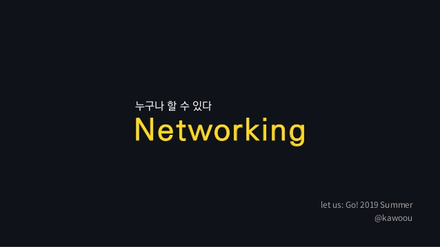 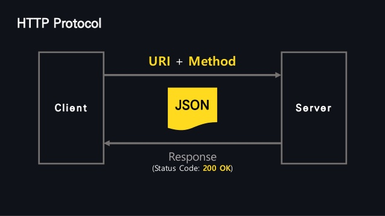 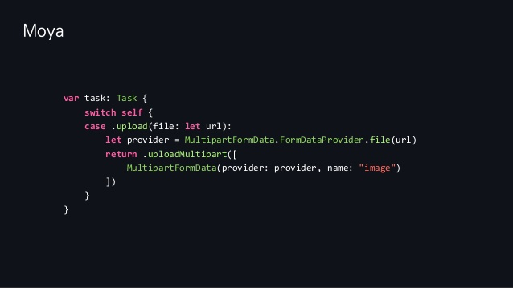

 

[**Let us: Go! 2018 Fall**](https://iosdevkor.github.io/let_us_go_2018_fall/)
> <알아보자 Dependency Injection과 Deli>라는 주제로 Dependency Injection에 대한 내용을 설명하고, Deli 라이브러리에 대해 발표했습니다.
>
> https://www.slideshare.net/ssuser86f623/dependency-injection-deli

* 기간 : 2018.10.20
* 내용 : 알아보자 DI와 Deli

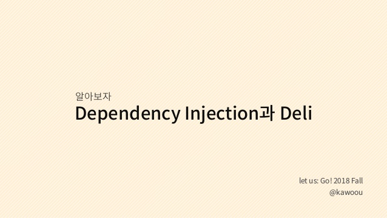 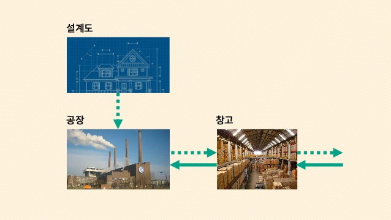 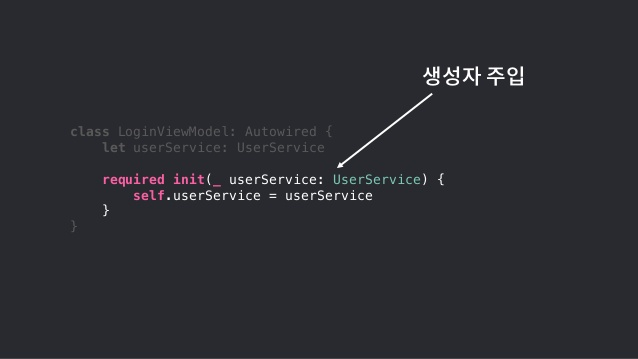

 

**ZeroPage**

> 중앙대학교 ZeroPage라는 학회에서 <디발자가 말하는 시선을 끄는 PPT>라는 주제로 OMS(Open Micro Seminar)에서 발표했습니다.
>
> https://www.slideshare.net/ssuser86f623/ppt-33026595

* 기간 : 2014.04.02
* 내용 : 디발자가 말하는 시선을 끄는 PPT

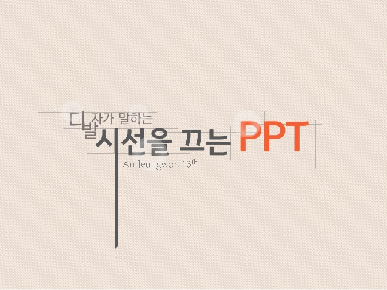 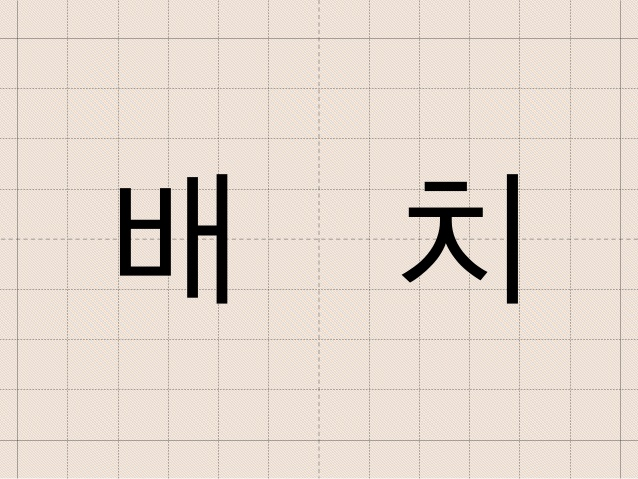 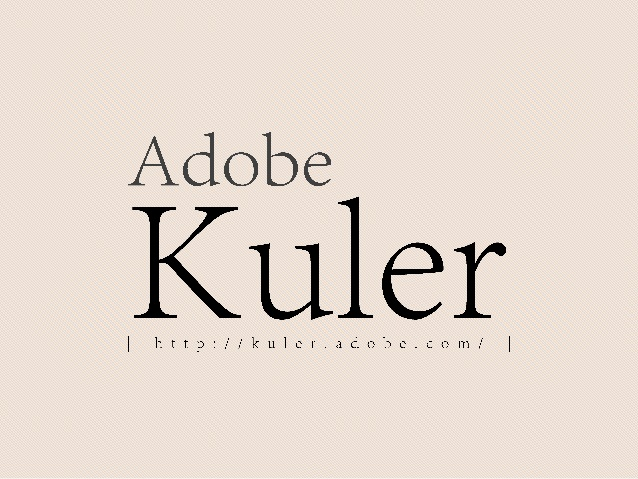

 

**Youth Voice 미디어교육 강사**
> 다음세대재단의 유스보이스 교육 프로그램에서 중학생들을 대상으로 RPG Maker를 이용한 3명이서 게임 개발에 대한 강의를 진행했습니다.

* 기간 : 2013.07 ~ 2013.08
* 내용 : 게임 개발자 되기

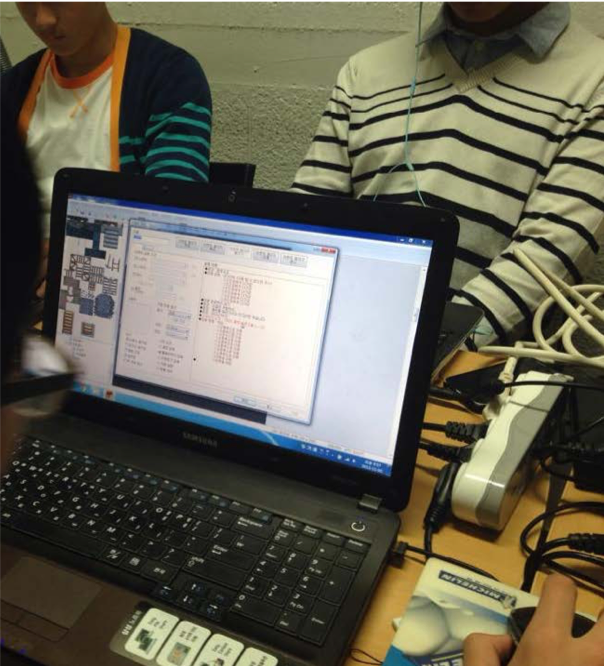 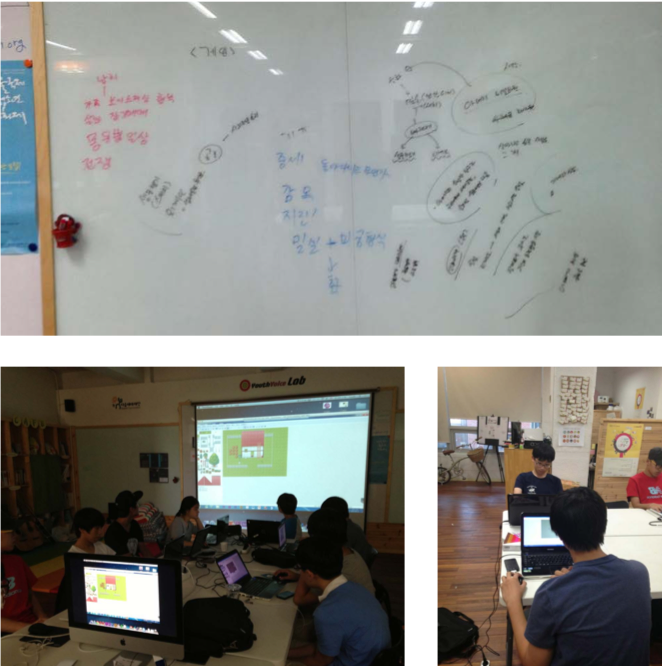

 

**Micro Software 잡지 기고**
> <소셜 큐레이션 서비스와 노란 손수건>이라는 제목으로 Facebook 피드 데이터를 큐레이션하여 시각화시킨 경험을 기고했습니다.
>
> http://www.moazine.com/article/detail.asp?articleid=637839

* 기간 : 2012.07 ~ 2012.10
* 내용 : 소셜 큐레이션 서비스와 노란 손수건

  

 

[**Software Maestro 2기**](http://swmaestro.kr/)
> 지식경제부에서 진행하는 SW Maestro라는 연수 프로그램에 선발되어, 2단계까지 1년의 기간동안 다양한 프로젝트를 진행했습니다.

* 기간 : 2011.07 ~ 2012.06

 

## 프로젝트

**Toss**

> 현 직장

* 회사 : ㈜비바리퍼블리카
* 개발 기술
  * 백엔드 : Serverless, Kotlin, Spring Boot 3.1.x, WebFlux, Coroutine, R2DBC, Flyway
  * iOS : Swift Concurrency, RxFlow, ReactorKit, RIBs, Jenkins, Fastlane, FlexLayout, Tuist, Xcodegen, etc..
* 담당 업무
  * Card 사일로
    * 내 신용 정보 서비스 / 토스머니카드 / 토스신용카드 / 카드 혜택 추천 서비스
    * Server-driven UI 방식의 제휴카드 발급 퍼널 구현
  * Paper0 사일로
    * Server-driven UI 방식의 내문서함 서비스 구현
    * 무인편의점 출입증 / 증명서떼기 서비스
  * Pay 사일로
    * 토스 결제 / 현장결제 서비스
  * Client Platform 팀
    * Client Platform 서버 구축
    * Swift 서버 구축 및 Lambda 배포 파이프라인 구성    
    * 앱 초기화 과정 재설계
    * 의존도가 높고 블랙박스 핵심 레거시 청산
    * Remote Config와 유사한 내재화된 TUBA 시스템을 재설계 및 TUBA 기반 점진적 배포
    * 네트워크 모듈 재설계
    * Kingfisher의 기능을 재설계하여 내재화
    * WebP 이미지 Decoder 구현
  * Face Pay 사일로
    * iOS 얼굴 인증 모듈 관련 R&D
    * 성능 최적화를 위한 MetalPerformanceSharder 활용
    * Depth 정보와 CoreML을 이용하여 Liveness 처리
  * 토스증권
    * 토스 차트 구현
  * 개선 기여
    * 비밀번호 인증, 생체 인증, 암호화 로직 전반 재설계
    * 문자열이 메모리에 남지 않도록 하는 EncryptedString, SecureLabel, SecureTextField 구현
    * Swift AST 기반 워크스페이스 타입 정보 파싱을 위한 내부 라이브러리 개발
    * DI를 구현하여 적용, 컴파일 단계에서 의존성 검증이 가능한 툴을 구현하여 적용
    * Unicode 파싱이 가능한 정규식 기반 URIComponents 구현
    * Tuist 도입 및 모듈화
    * WKWebView stale-while-revalidate 기능 구현
  * 코드 리펙토링, 버그 수정 등
* 홈페이지 : https://toss.im
* 앱스토어 : https://apps.apple.com/kr/app/%ED%86%A0%EC%8A%A4/id839333328?mt=8

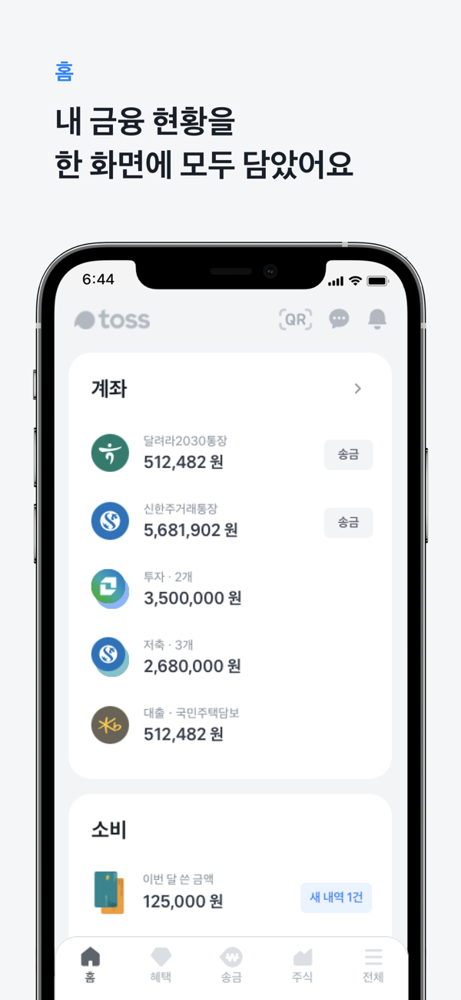 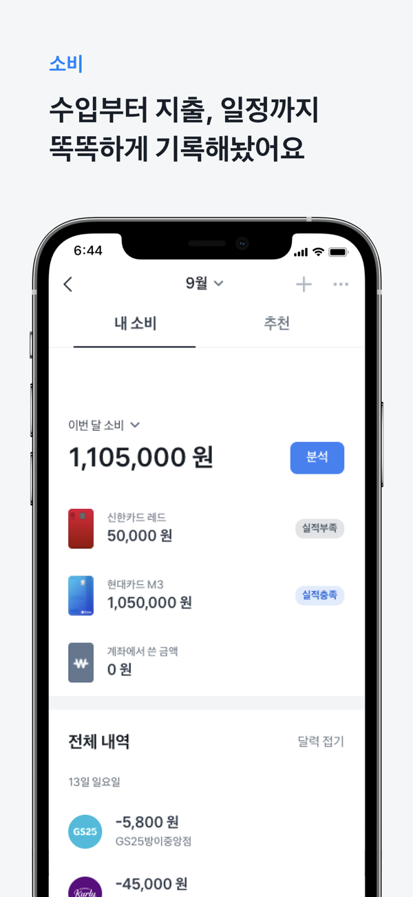 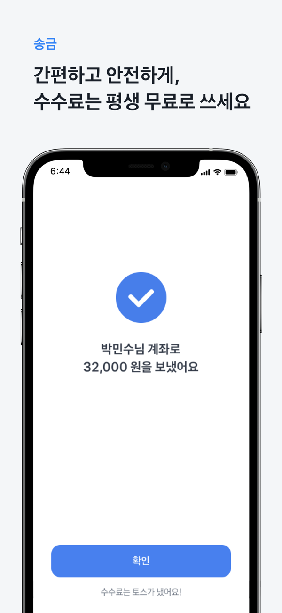 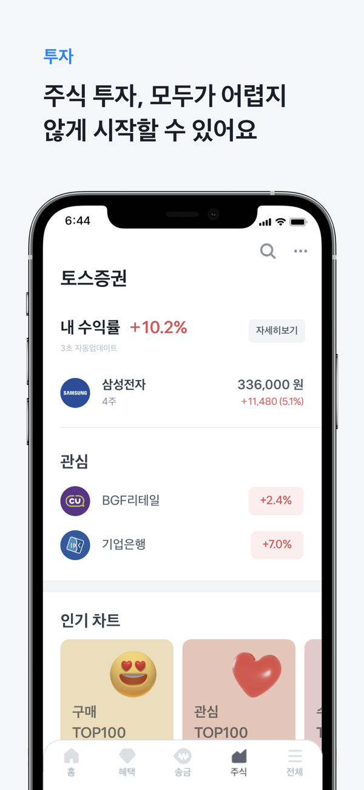 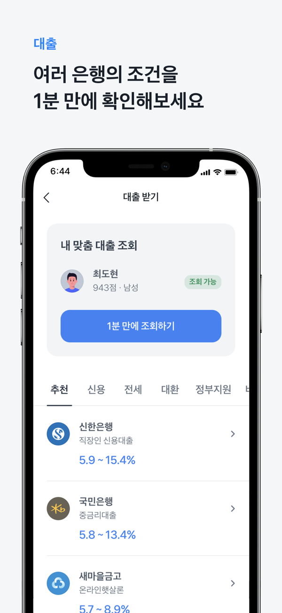

 

**KONGKONG**

> 외주로 진행한 프로젝트로 백엔드, 프론트엔드 전반을 담당했습니다. Thymeleaf 기반으로 웹사이트 구현 및 모바일 앱을 위한 Rest API 구현을 진행했습니다.
> 백엔드의 경우 멀티 모듈로 Kotlin, Spring Boot 기반에 Spring Security, JPA를 사용하였으며, 프론트엔드는 Thymeleaf, jQuery, Less로 구현했습니다.
> 이중화가 가능한 구조로 구현되어 수평 확장이 가능하며, 베트남, 인도네시아를 위한 다국어 처리를 진행했습니다. 

* 회사 : Gluri
* 개발 기술
  * 인프라 : 전체 인프라를 AWS 싱가폴 리전에 구성
  * 백엔드 : Kotlin, Spring Boot 2.1.x, Spring Security, JPA(Hibernate), Gradle, Redis, Sentry, Thymeleaf
  * 프론트엔드 : jQuery, Less, Lodash
* 담당 업무
  * AWS 기반 인프라 구성
  * 웹사이트 구현 및 모바일 앱을 위한 Rest API 구현
  * 관리자 페이지 구현
  * 다국어 처리
* 홈페이지 : https://kongkong.kr

 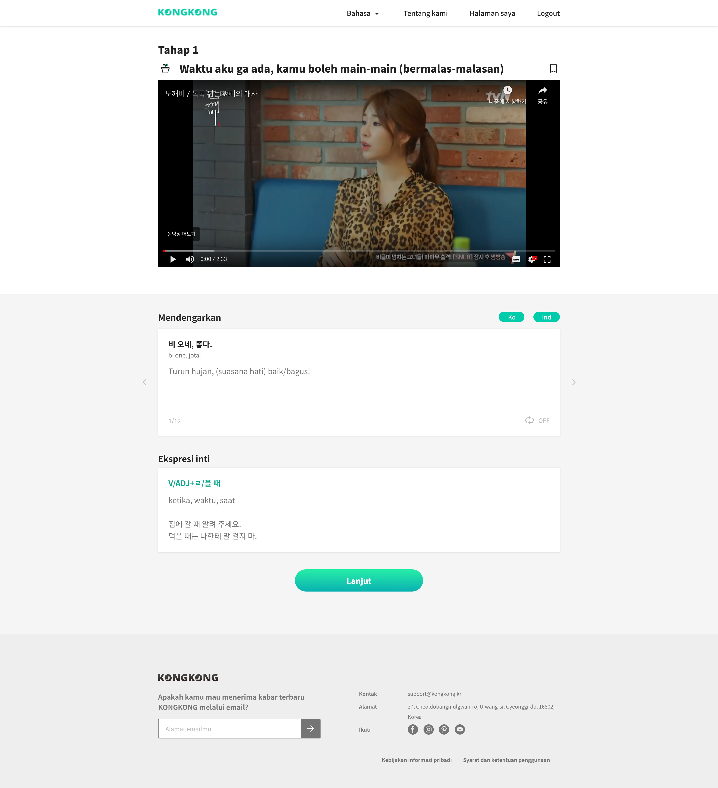 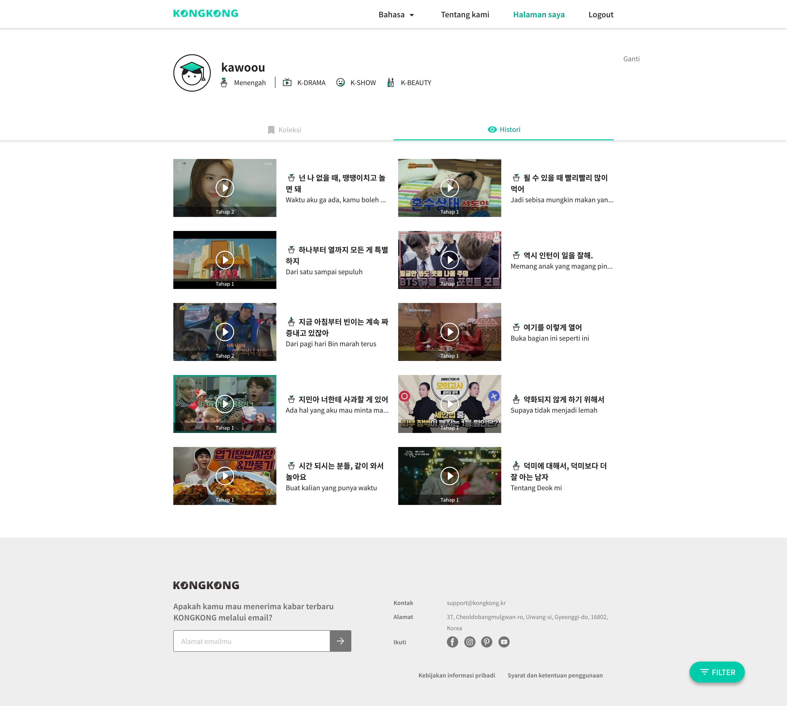

 

**Azar**

> Hyperconnect에서의 Azar라는 프로젝트는 Swift 1.x부터 진행되었던 프로젝트였기에 Legacy 코드가 많았습니다. 그러다보니 Feature 작업이 아니라면 대부분의 시간은 정리 위주로 작업했습니다. Objective-C 기반으로 개발된 네트워크 모듈을 Swift로 재정리하고, IAP나 APNS와 같은 Core 모듈에 대한 리펙토링, 그리고 기존 Objective-C 기반의 라이브러리를 제거와 함께 Kingfisher, RxSwift, Alamofire 라이브러리도 도입했습니다.

* 회사 : Hyperconnect
* 개발 기술 : Swift, SwiftLint, SQLite, RxSwift, ReactorKit, WebRTC, Firebase, GTM, GA
* 담당 업무
  * Azar 서비스에서 신규 Feature 작업 및 리펙토링
  * CI 스크립트 개선
* 홈페이지 : https://www.azarlive.com
* 앱스토어 : https://itunes.apple.com/us/app/azar-video-chat-discover/id972558973?mt=8

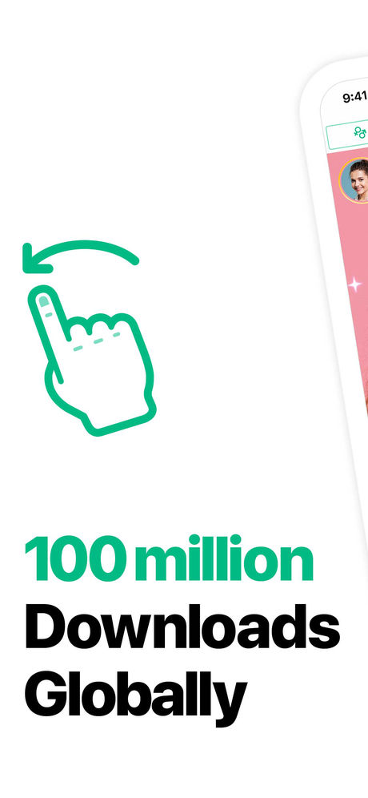 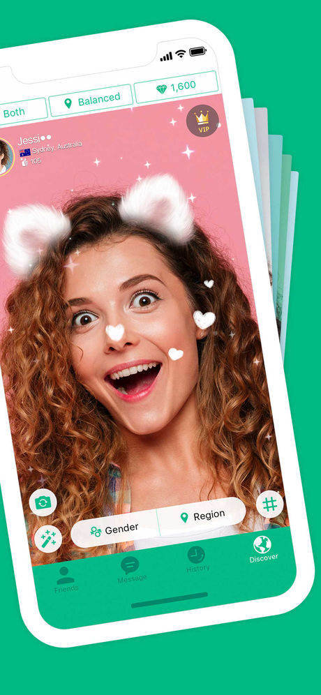 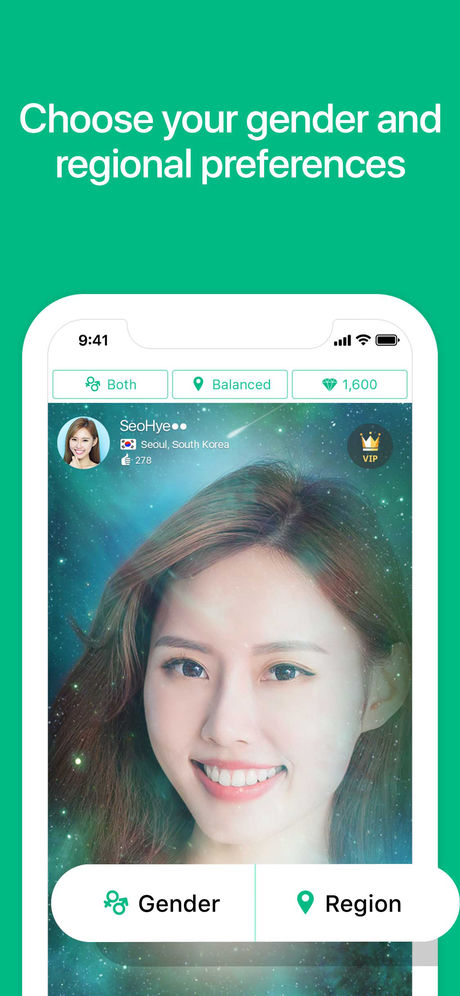 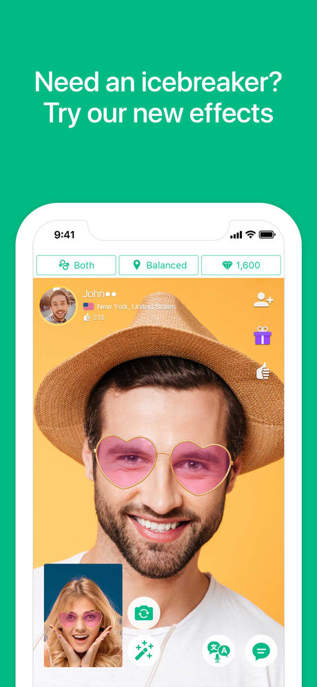 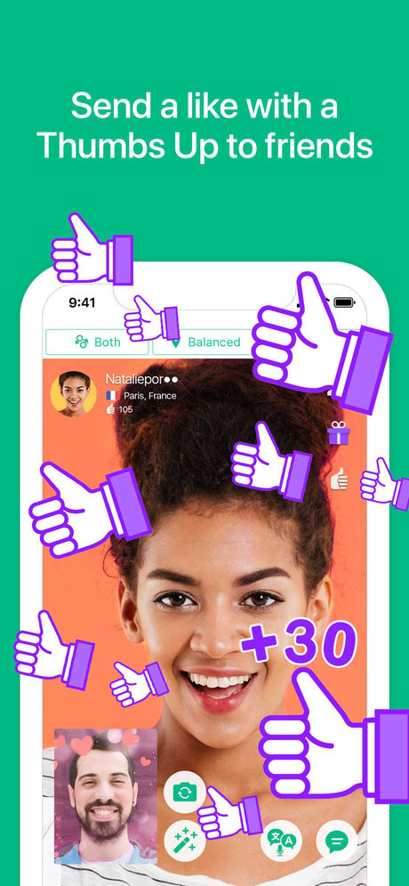

 

**Metro Conflict (Xuất Kích)**

> 병역 특례를 위해 Redduck에 입사했습니다. UnrealEngine3로 구현된 Metro Conflict라는 게임은 Awesomium이라는 Chromium 기반 엔진 위에서 Web UI를 구성하는데, 게임 회사다 보니 Front-end 개발을 해본 적 없는 C/C++ 개발자들이 작성해둔 기존 코드를 활용할 수 없어 AngularJS로 시스템 전반을 재구현했습니다.
>
> 웹 개발자가 없는 회사다 보니 타 팀과 혼자서 작업을 진행했습니다. 게임의 네트워크 시스템은 Socket 통신을 수행하며 UnrealScript로 작성된 해당 부분에 대한 최적화를 진행했으며, Party, Clan, Matching, Inventory, Shop, Custom Game, Chat 등 인게임 시스템을 제외한 모든 부분을 컨트롤하며 구현 및 수정했습니다. 또한 타 팀에 대한 서포팅으로 소스코드 파일 파싱을 통한 총기 세팅 정보 추출 툴과 렌더 이미지를 가공하여 Web UI 및 Flash HUD에서 사용되는 이미지로 추출하는 툴을 구현하고 배포했습니다.
>
> [Metro Conflict: The Origin](https://store.steampowered.com/app/662320/METRO_CONFLICT_THE_ORIGIN/)

* 회사 : Redduck
* 개발 기술 : AngularJS, Less.js, Grunt, Node.js, C#, Unreal Script
* 담당 업무
  * 로비 시스템 신규 구현
  * 리소스 관리 규칙 정리
  * VBA을 이용한 XML Export 시스템 작업
  * 툴 구현(Weapon Exporter / Render Exporter)
  * 로비와 게임 시스템 간의 최적화 진행

   

 

**Dingo API Server**

> iOS팀에서 Backend팀으로 넘어간 후 Dingo라는 서비스의 API 서버를 Java Spring으로 구현했습니다. 팀에서 API 서버 설계 구현 뿐만 아니라 다양한 시스템 구현을 진행했습니다.

* 회사 : Makeus Mobile
* 개발 기술 : Spring, Maven, MyBatis, Python
* 담당 업무
  * 서버 및 인프라 설계 참여
  * API 서버 구현
  * 캐시 및 리전 별 DB 및 DNS 동기화 전략 - 현지 네트워크 환경 측정
* 홈페이지 : http://www.dingo.tv  /  http://id.dingo.tv

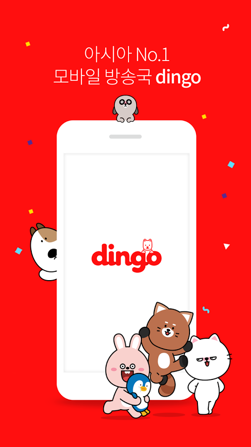 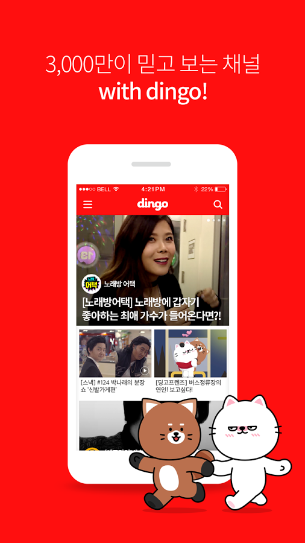 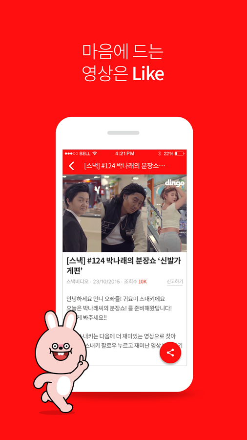

 

**Moncast iOS**

> 초기 iOS 앱은 외주로 작업 진행되어 코드 리펙토링을 우선으로 진행했으며, 코드의 정리가 이루어진 후 신규 앱 기획으로 인해 바로 새 버전 앱을 구현하게 되었습니다. 사실 팀이라고 부를 수 없을 정도로 iOS 개발자가 아무도 없어 혼자서 개발하다 보니 어려움이 많았지만 경험을 많이 쌓을 수 있었습니다.
>
> 신 버전은 기존에 구현되어 있던 영상 플레이와 꼴라주 기능 뿐만 아니라 이미지 컨텐츠, 라 이브 영상 컨텐츠, PIP 및 세로 비디오 기능을 포함하여 구현되었다.
>
> 하지만 회사에서 브랜드명을 변경하면서 Moncast는 사라지고 시니어 개발자를 뽑아 Dingo 라는 서비스로 해외 런칭을 목표로 신규 구현을 시작하며, 스스로의 발전을 위해 Backend팀 으로 팀을 이동했습니다.

* 회사 : Makeus Mobile
* 개발 기술 : Objective-C, Splunk Mint, AFNetworking, GA
* 담당 업무
  * iOS 리펙토링 및 신 버전 작업
  * 서비스 기획 참여

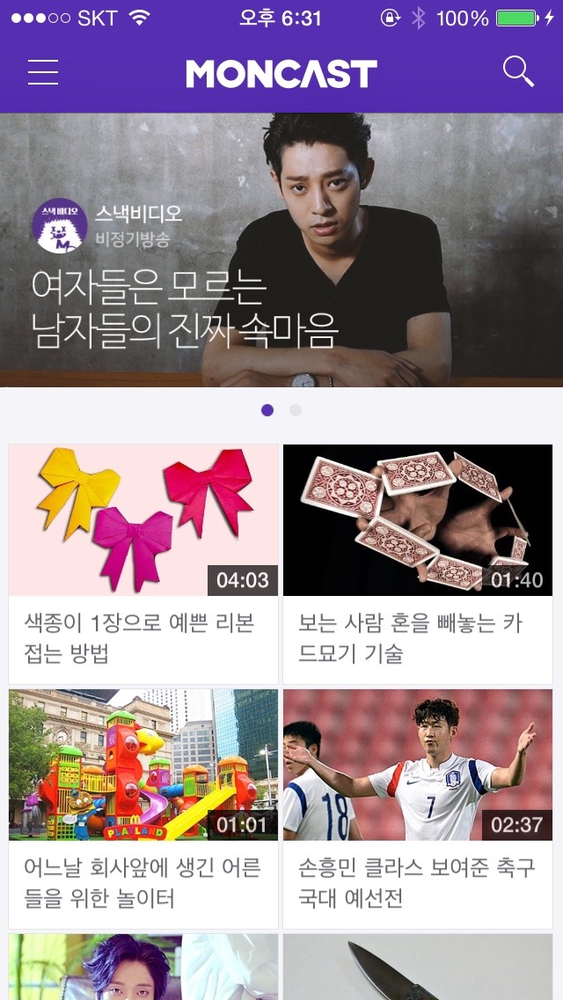 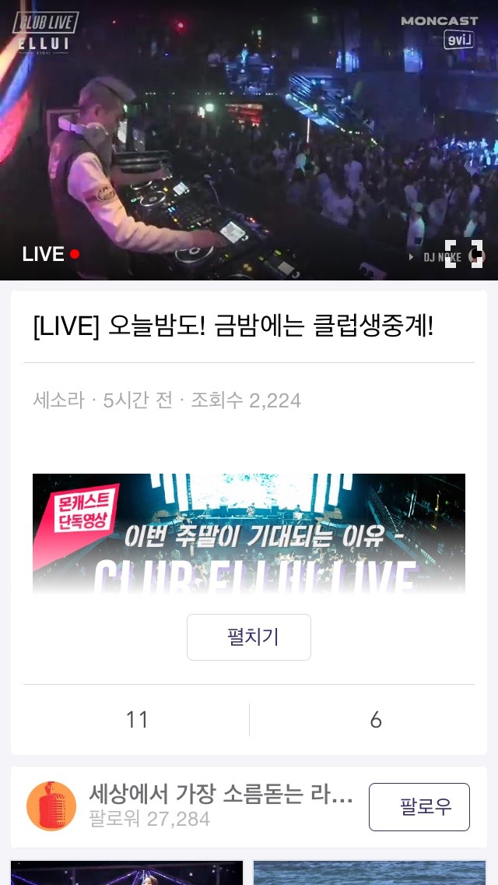 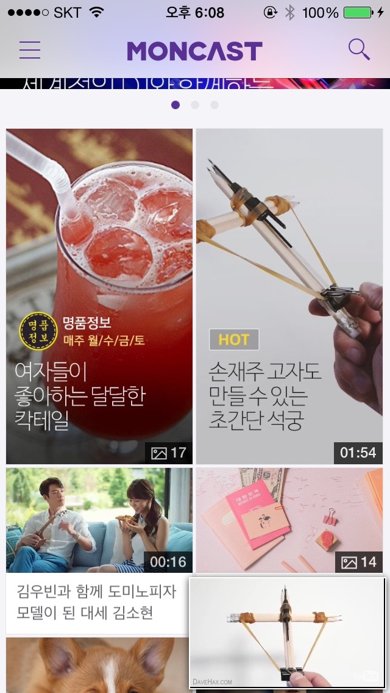

 

**노래의 신 iOS**

> “노래의신” iOS 앱 개발 외주로 인해 Makeus Mobile이라는 회사를 처음으로 마주했습니다. 이 앱은 Youtube 영상플레이어와 같은 PIP 기능을 제공하는 앱을 만들었습니다. 
>
> 하지만 회사 사정상 서비스를 포기하기로 결정되어 런칭하지 못했지만, 취직을 제안받아 입사하게 되었습니다.

* 회사 : 외주
* 개발 기술 : Objective-C
* 담당 업무
  * iOS 앱 신규 개발

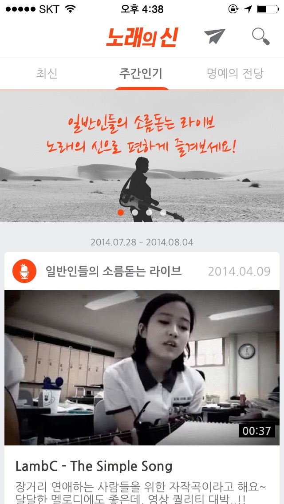 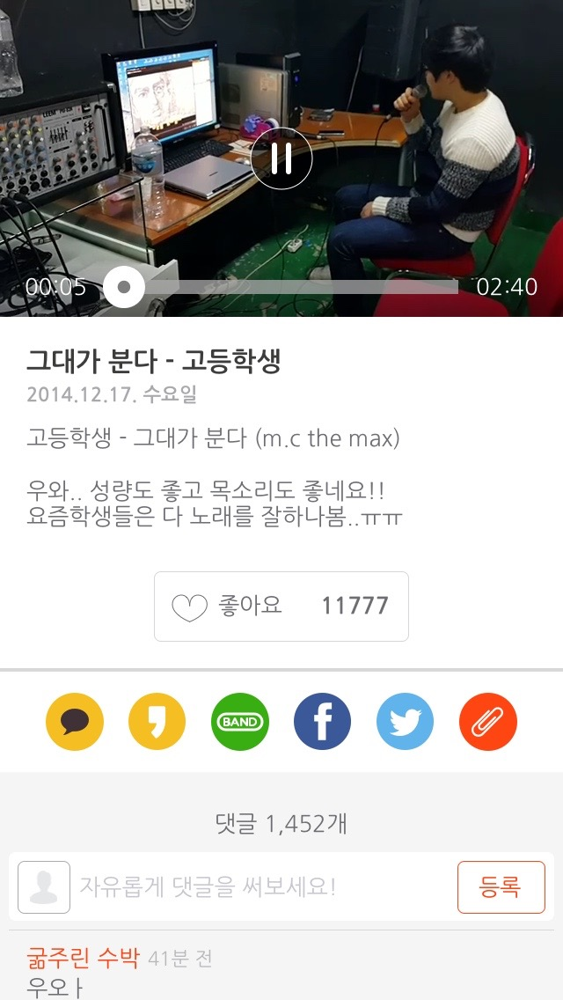

 

**Add2Paper**

> 학교와 병행을 조건으로 iOS 앱 리펙토링을 위해 입사했습니다. 입사 때에는 앱을 제작하고 갔던 개발자가 영상 처리를 주로 하는 개발자였기에 대부분의 코드를 C++로 작성했기에 처음부터 다시 개발을 진행했습니다.
>
> 이후 PM이라는 직책을 처음으로 경험하여 실수도 트러블도 있었지만 신규 3.0 버전 서비스를 마무리 지었고 많은 경험을 할 수 있었던 회사입니다.

* 회사 : Add2Paper
* 개발 기술 : Objective-C, Crittercism
* 담당 업무
  * iOS 리펙토링 및 신 버전 작업
  * 컨셉 디자인 작업
  * 서비스 개발 및 디자인 일정 관리
  * 서비스 기획 참여 - 외부 미팅 참여
* 홈페이지 : https://www.add2paper.com/

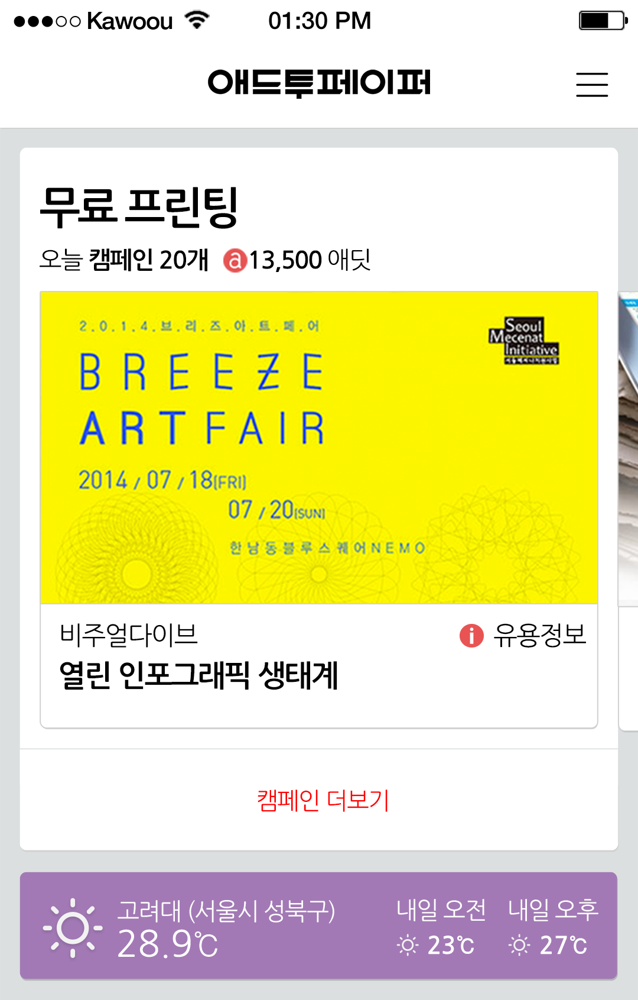 

 

**UrQA Client iOS**

> 해당 프로젝트는 Mobile 크래시 추적툴로 Splunk Mint와 같이 라이브 서비스에서 문제가 발생할 시 자동으로 리포팅되는 시스템에, 추가적으로 사용자 행동 패턴 분석을 위한 Breadcrumb 기록과 같은 기능이 포함된 서비스입니다. 당시 iOS에서 발생하는 Crash를 추적하는 Framework를 개발했습니다. 당시 실제로 발생한 크래시에 대한 Symbolication은 정상적으로 동작하여 배포 단계까지 왔으나, 서버 측에서 Symbolication을 하기 위한 atosl에 대한 대응이 늦어져 결국 결과는 없었던 프로젝트입니다.

* 회사 : 외주
* 개발 기술 : Objective-C, C++, PLCrashReporter, atosl
* 담당 업무
  * iOS Crash Report Framework 구현

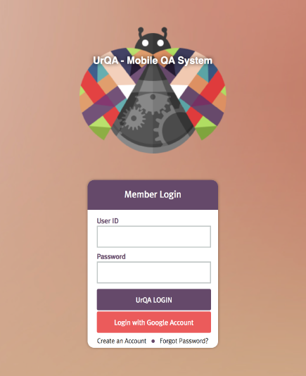 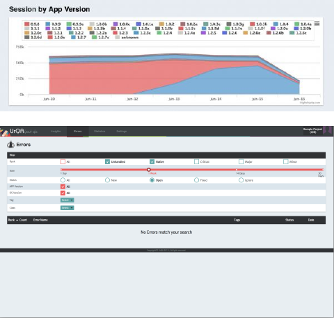 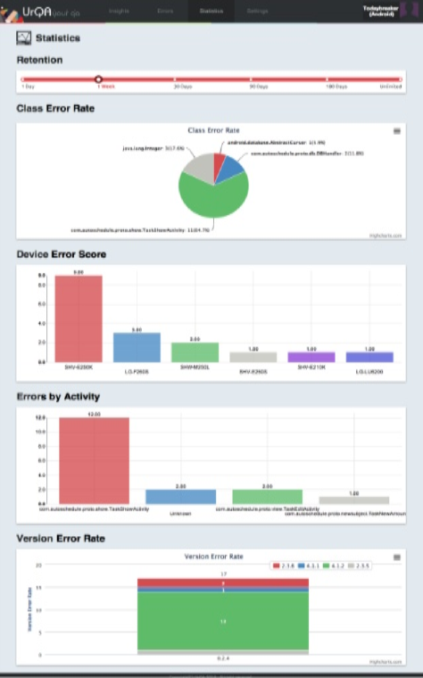

 

**Alamry (Sleep If U Can)**

> 사진 찍어 끄는 알람으로 알려진 Sleep If U Can이라는 서비스의 초기 멤버로 참여하여 소규모 의 인원으로 서비스를 개발했습니다. 사람이 적다보니 서비스의 디자인 작업을 같이하였으며, 회사를 소개하는, 앱을 소개하는 웹사이트와 실제 담당 업무였던 iOS앱 개발을 진행했습니다.
>
> 초기에 iOS앱은 외주로 작업되어 있다보니 코드의 Quality나 크리티컬한 이슈가 많이 발생하여 새로 개발하는 것이 나을 것이라 판단하였고, 기존에 마켓에 올라가 있는 서비스에서 발생하는 이슈를 수정하는 동시에 서비스의 기획부터 함께 진행하여 Alarmy라는 이름으로 런칭했습니다.
>
> http://www.slideshare.net/ssuser86f623/ssul-35104644

* 회사 : DelightRoom
* 개발 기술 : Objective-C, OpenCV, BugSense, Localytics, Vanilla js
* 담당 업무
  * iOS 리펙토링 및 신 버전 작업
  * CI / BI / 프로모션 / 광고 / 명함 / 아이콘 디자인
  * Android / iOS 앱 디자인
  * 앱 기획 참여
* 앱스토어 : https://itunes.apple.com/us/app/alarmy-alarm-clock/id1163786766?mt=8

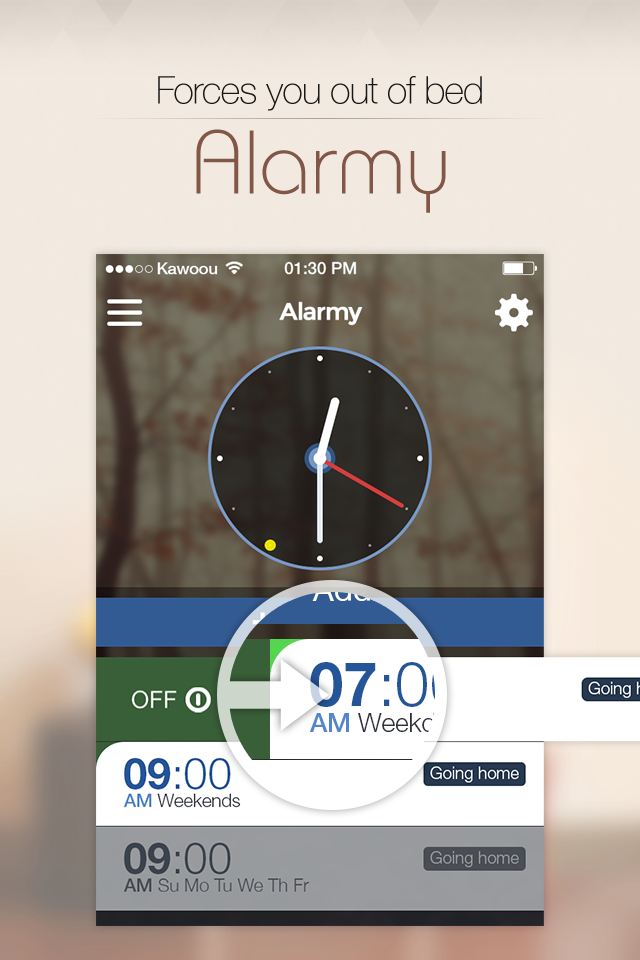 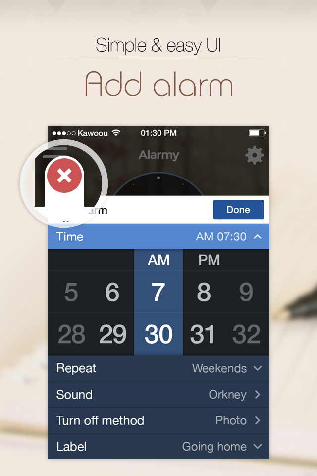

 

**Alarmy Site**

* 회사 : DelightRoom
* 개발 기술 : HTML4, CSS3, ECMA 5, jQuery
* 담당 업무
  * 웹 디자인 및 개발

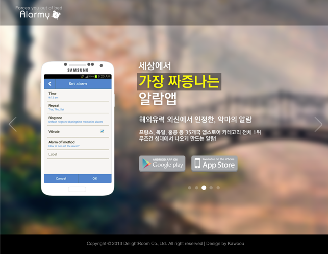 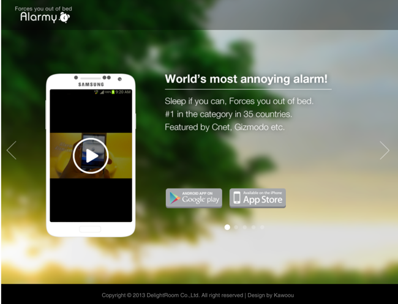

 

**DelightRoom Site**

* 회사 : DelightRoom
* 개발 기술 : HTML4, CSS3, ECMA 5, jQuery
* 담당 업무
  * 웹 디자인 및 개발

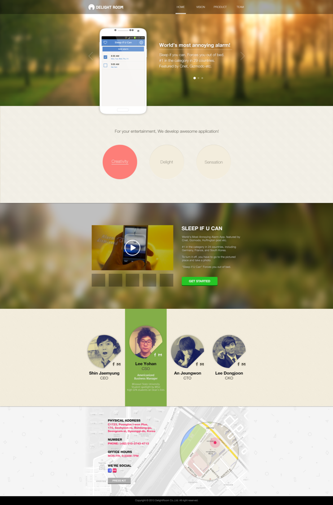

  

## 기타 프로젝트

### 프로젝트

**DynamicWAVE**

> 고등학생 시절, 친구들과 같이 게임을 만들기 위해 디자인했던 작품입니다.
> 리듬게임이라는 장르 자체가 손이 많이가고 성공 가능성 판단의 근거가 별로 없어서 오랜 기간동안 5번 정도를 새로 개발한 프로젝트였습니다.
>
> [Preview Video](https://www.icloud.com/iclouddrive/0N-n2sTGFEHO-C3LHVhOntjSQ#DynamicWAVE_for_Mobile.mp4)

* 개발 기술 : Corona SDK, Cocos2d-x, Lua

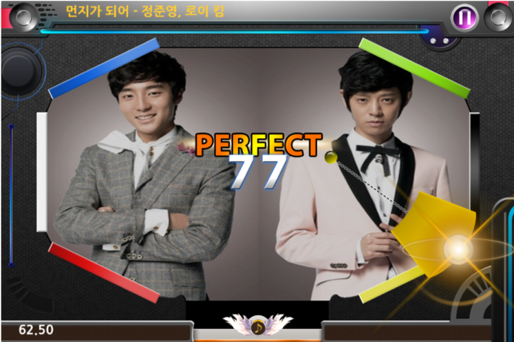 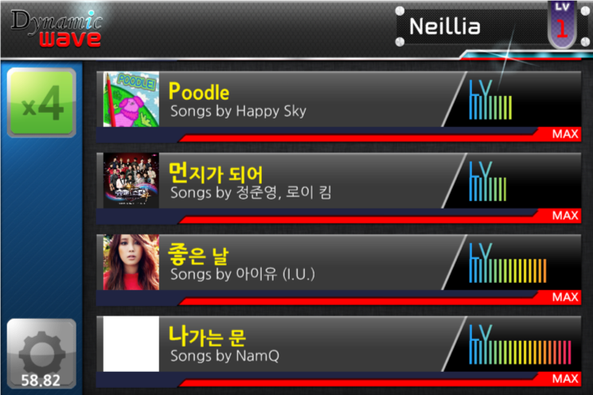

 

**4-Ball Billiards**

> 개인 취미로 만들던 DirectX Base의 게임 엔진 AProject3D 기반으로 구현한 게임으로 학교 프로젝트 과제로 제출했었습니다. 당구에서 사용되는 물리를 구현하였고, 엔진은 Camera, Scene, Input과 같은 기본적인 기능과 함께 Deferred Rendering을 통한 빛을 구현하였습니다.
>
> [Preview Video](https://www.icloud.com/iclouddrive/0uPQxaR7pn3sy5qz9tYtKRTUA#Billiards.mp4)

* 개발 기술 : DirectX 9.0, HLSL, C++

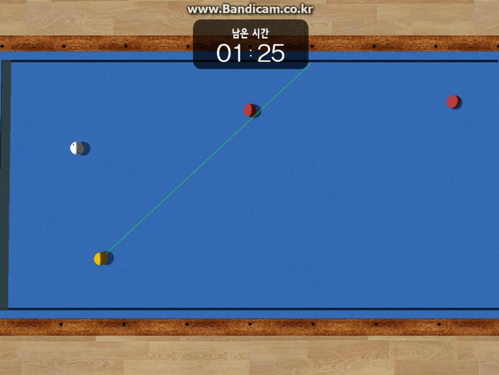 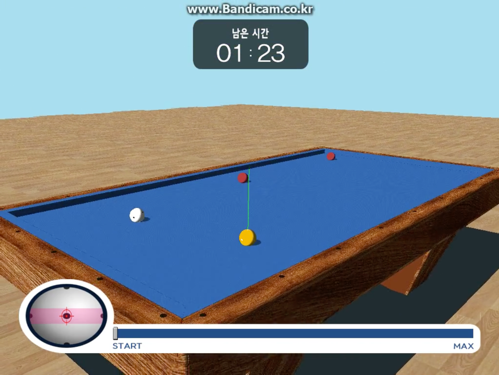 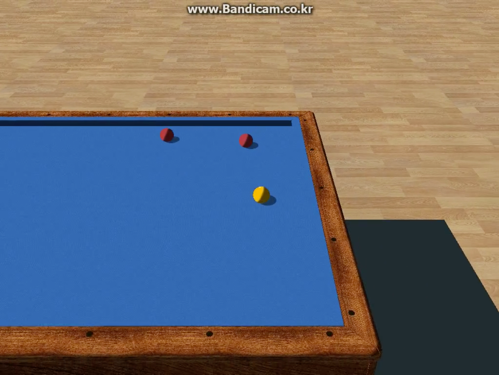  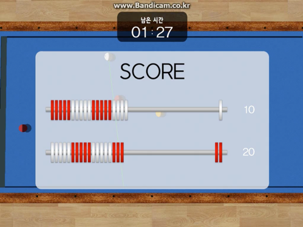

 

**Yellow Ribbon**

> 페이스북 데이터를 기반으로 주위 사람들이 말하는 단어들을 큐레이션하여 보여주는 프로젝트입니다. 이 프로젝트는 ActionScript 3.0 기반으로 개발하였으며, 랜덤하게 나무를 만들어내고 렌더링하는 알고리즘을 설계하고 구현하였습니다.
>
> [Preview Video](https://www.icloud.com/iclouddrive/0msm2iBfmQ-XTt7TGO_Ndpu1Q#Yellow_Ribbon.mp4)

* 소속 : Software Maestro 2nd
* 개발 기술 : Flash Builder, ActionScript 3.0

 

 

### 오픈소스

[**FlexibleImage**](https://github.com/kawoou/FlexibleImage)

> 
>
> FlexibleImage is implemented with the hope that anyone could easily develop an app that provides features such as Camera Filter and Theme. When you write code in the "Method Chaining" style, the effect is applied in the appropriate order.

[**Deli**](https://github.com/kawoou/Deli)

> 
>
> Deli is an easy-to-use Dependency Injection Container that creates DI containers with all required registrations and corresponding factories.
>

[**AnyDate**](https://github.com/kawoou/AnyDate)

> 
>
> Swifty Date & Time API inspired from Java 8 DateTime API.

[**KWDrawerController**](https://github.com/kawoou/KWDrawerController)

> 
>
> Drawer view controller that is easy to use!

[**jquery-korean-pron**](https://github.com/kawoou/jquery-korean-pron)

> 
>
> 한국어 발음 변환 라이브러리

[**Animeal**](https://github.com/Animeal/animeal-web-for-exhibit)

> 
>
> Animeal Web for Exhibition on [Sookmyung Women's University](http://www.sookmyung.ac.kr/).

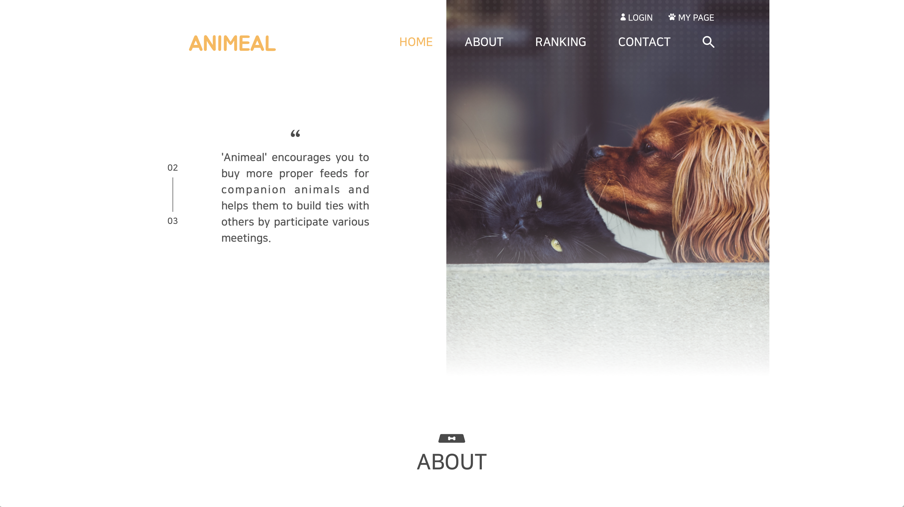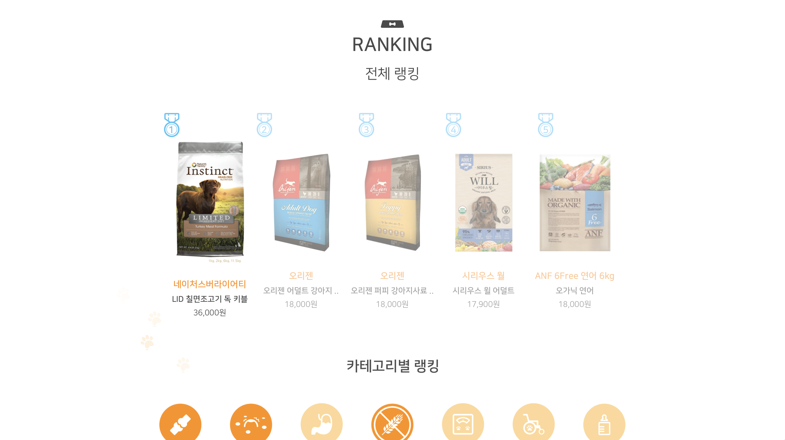

 

[**Codeigniter Docs**](https://github.com/owen1025/codeigniter-apidocs)

> 
>
> Parsing Codeigniter project's controller and make api documents. Also provide Request Form and Response Form for api testing.

 

### 오픈소스 기여

[**SwiftUI-Cheat-Sheet**](https://github.com/SimpleBoilerplates/SwiftUI-Cheat-Sheet)

> 
>
> SwiftUI Cheat Sheet

[**SnapKit**](https://github.com/SnapKit/SnapKit)

> 
>
> A Swift Autolayout DSL for iOS & OS X http://snapkit.io

[**Stencil**](https://github.com/stencilproject/Stencil)

> 
>
> Stencil is a simple and powerful template language for Swift. https://stencil.fuller.li

[**Gradients**](https://github.com/cruisediary/Gradients)

> 
>
> 🌔 A curated collection of splendid 180+ gradients made in swift

[**RxValidator**](https://github.com/vbmania/RxValidator)

> 
>
> Easy to Use, Read, Extensible, Flexible Validation Checker

  

## 입상 및 수상

* 제4회 전국 고교생 게임 아이디어 공모전 입선
  * 주최 : 서강대학교
  * 날짜 : 2011.10.08
* 제9회 전국학생게임 공모전 입선
  * 주최 : 공주대학교
  * 날짜 : 2011.09.02
* 2011년도 전국 기능경기대회 (게임 제작 부문) 장려상
  * 주최 : 기능경기대회위원회
  * 날짜 : 2011.09
* 한국정보올림피아드 전국대회 (경시부문) 장려상
  * 주최 : 한국정보과학회
  * 날짜 : 2011.08.24
* 한국정보올림피아드 도대회 (공모부문) 은상
  * 주최 : 한국정보과학회
  * 날짜 : 2011.08.19
* 한국정보올림피아드 도대회 (공모부문) 금상
  * 주최 : 한국정보과학회
  * 날짜 : 2011.08.19
* 2011년도 지방 기능경기대회 (게임 제작 부문) 동상
  * 주최 : 기능경기대회위원회
  * 날짜 : 2011.04.25
* 2010학년도 제7회 학교장배 게임제작 발표대회 금상
  * 주최 : 한국게임과학고등학교
  * 날짜 : 2011.03.05
* 2011년도 전북 지방 중소기업청 전국 학생 공모전 은상
  * 주최 : 중소기업청
  * 날짜 : 2011.03.02
* 한국정보올림피아드 도대회 (공모부문) 은상
  * 주최 : 한국정보과학회
  * 날짜 : 2010.08.19

